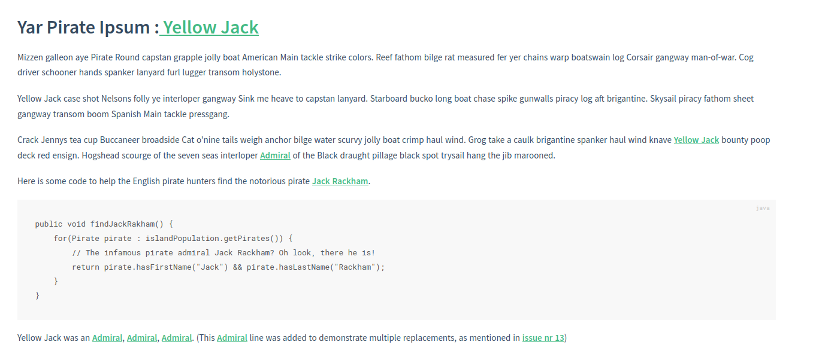

# docsify-glossary: SD Development Fork

[](https://sonarcloud.io/summary/new_code?id=stijn-dejongh_docsify-glossary)

Simple Glossary for Docsify that replaces occurrences of words in text with links to the glossary definitions.
Forked from [TheGreenToaster/docsify-glossary](https://github.com/TheGreenToaster/docsify-glossary) as the original
project was unmaintained for over 3 years, to address a couple of usability issues with the original script.

An example usage can be found here [./example](./example), it is deployed automatically to this [GitHub page](https://stijn-dejongh.github.io/docsify-glossary/#/).



## Installation

1. Download the latest version of the javascript (from our [releases page](https://github.com/stijn-dejongh/docsify-glossary/releases))
2. Add the script into your docsify source directory
3. Insert script into `docsify.template.js` document
  ```html
  <script src="./docsify-glossary.min.js"></script>
  ```
4. Create a `_glossary.md` file in the root directory
5. Populate the `_glossary.md` file with terms.

## Plugin Usage

* Terms must be predicated with a consistent Markdown heading to get recognized by the glossary (see configuration)
* Terms are replaced with links in the order that they appear in the glossary file.
  * This is especially relevant for nested terminology ( e.g. _API_ and _API Usage_)

### Configuration

This version of the `docsify-glossary` plugin allows you to configure multiple aspects of the glossary.
An example configuration is shown here:
```yaml
glossify: {
    debug: false, # default
    glossaryLocation: './X_Appendix/Glossary/HOME.md', # default is '_glossary.md'
    terminologyHeading: '##', # default is '####', overwrite to fit your glossary heading depth
    replaceTitleTerms: false  # default is 'true'
}
```

## Running the code

In order to run the code, you will need a node set-up on your local machine.
We recommend using [Node Version Manager](https://npm.github.io/installation-setup-docs/installing/using-a-node-version-manager.html) to make this easier.

### Building the code

1. Globally install [docsify](https://docsify.js.org/#/quickstart): `npm i docsify-cli -g` 
2. From the project root directory, run: `npm install`
3. To build the code, run: `npm run ci`
4. THis will compile, test, and package the plugin

### View the example website

Once the code has been built, you can launch the example website illustrating the use of the glossary.
In order to do so: 

1. Go to [http://localhost:3000/]()
2. copy the latest version of the code into the example website: `cp ./dist/@stijn-dejongh/docsify-glossary* ./example`
3. Run `docsify serve example`

## Changelog

An overview of all the changes made to this codebase can be found in the [CHANGELOG](./CHANGELOG.md) file included in this repository.

## TODO list

* [x] Bump dependency versions
* [x] add unit tests to the code to make this package more maintainable


